# WEEK 2

### 1. Probability and Bayes' Rule
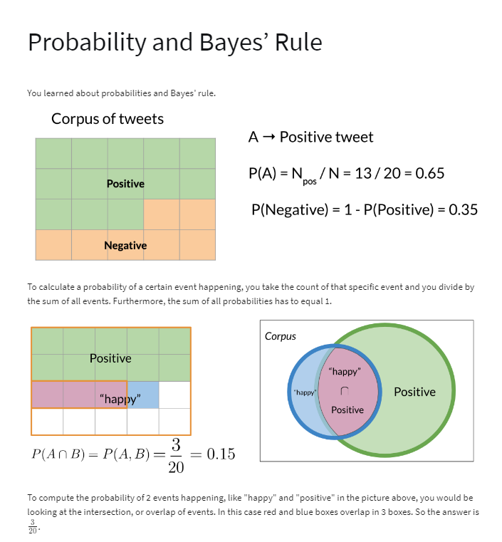

### 2. Bayes' Rule
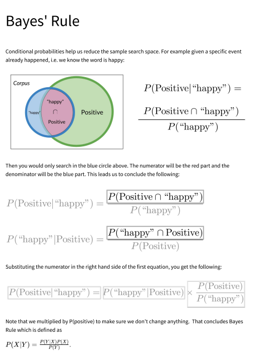

### 3. Naive Bayes Introduction
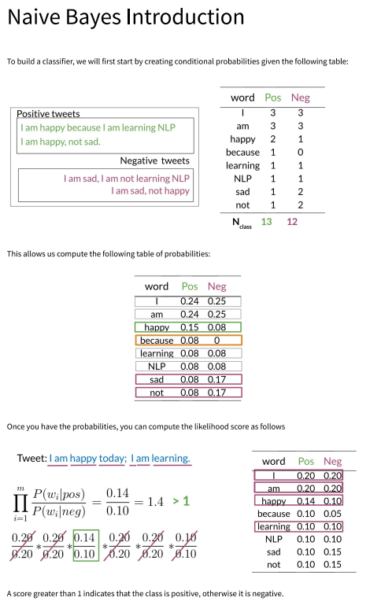

### 4. Laplacian Smoothing
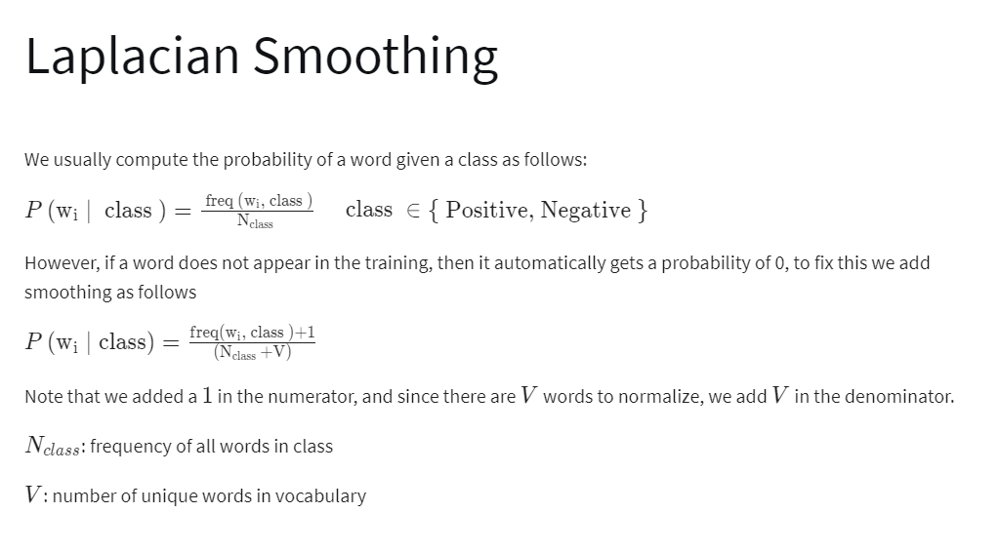

### 5. Log Likelihood
#### 5.1 Part 1
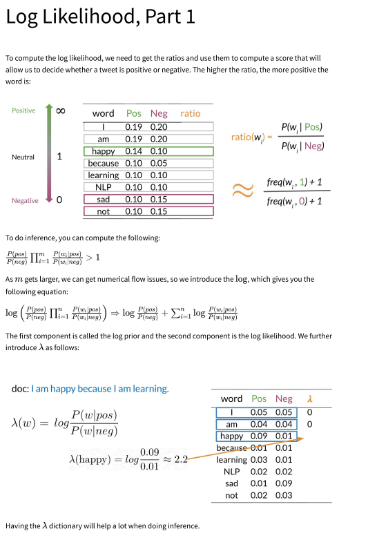

#### 5.1 Part 2
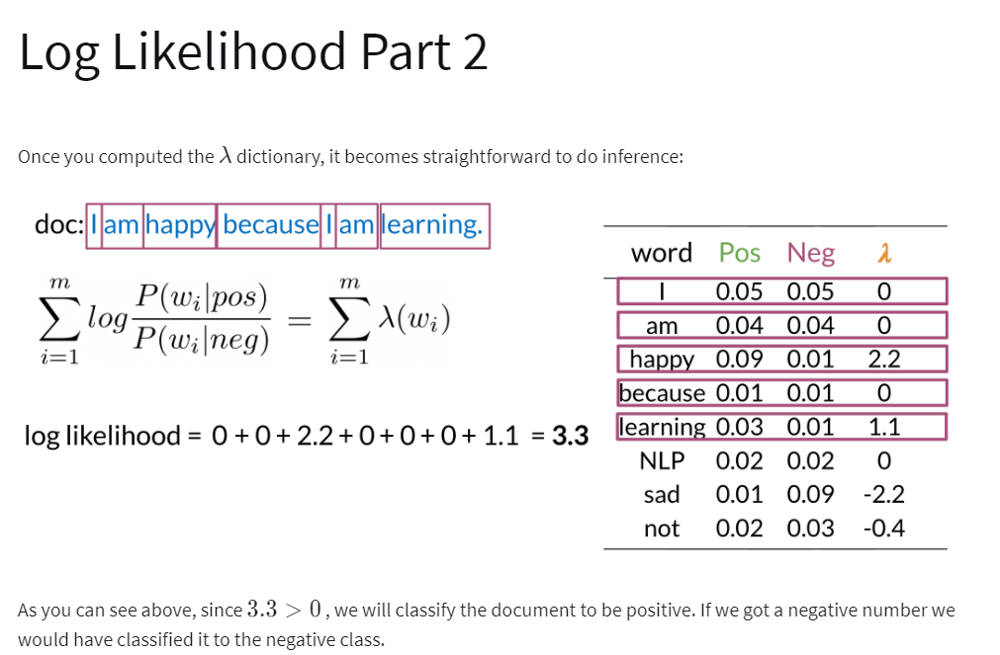

### 6. Training Naive Bayes
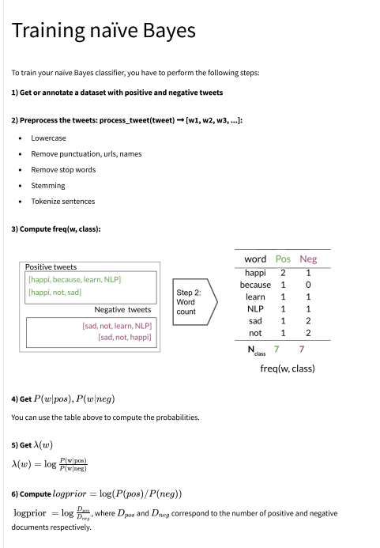

### 7. Testing Naive Bayes
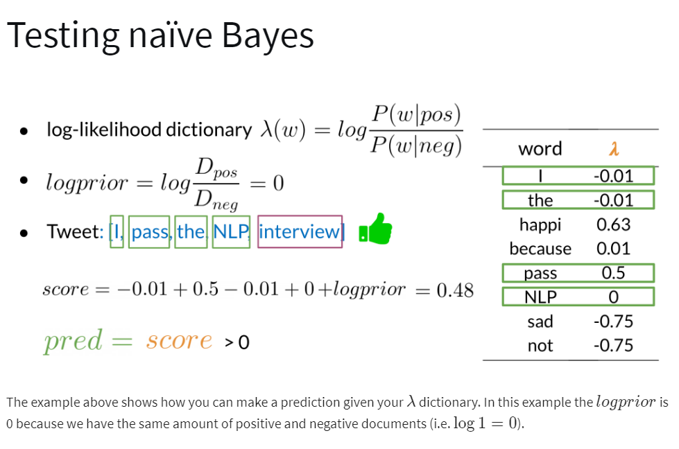

### 8. Application of Naive Bayes
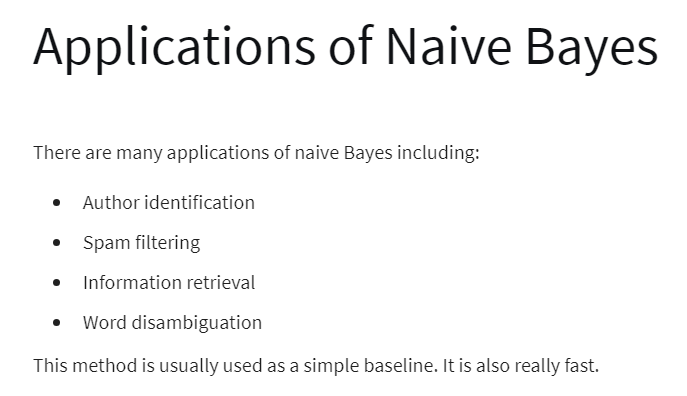

### 9. Naive Bayes Assumptions
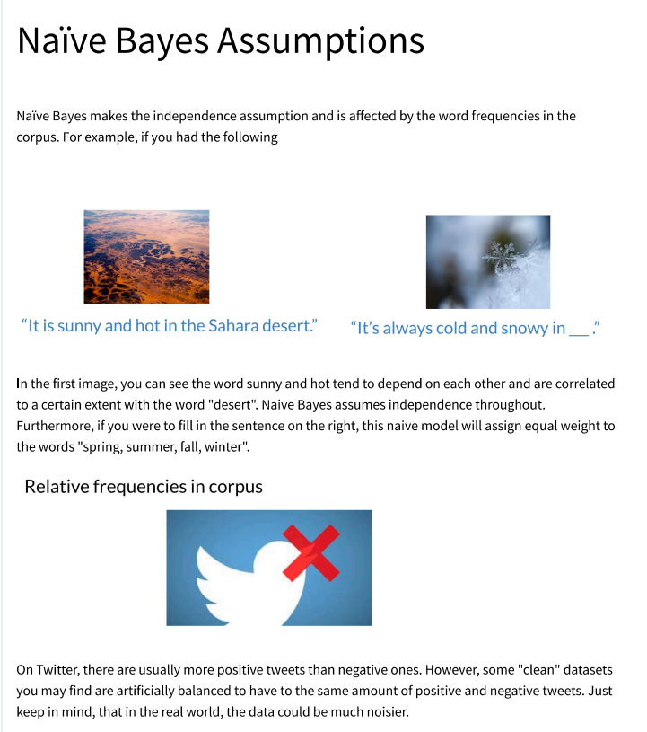

### 10. Error Analysis
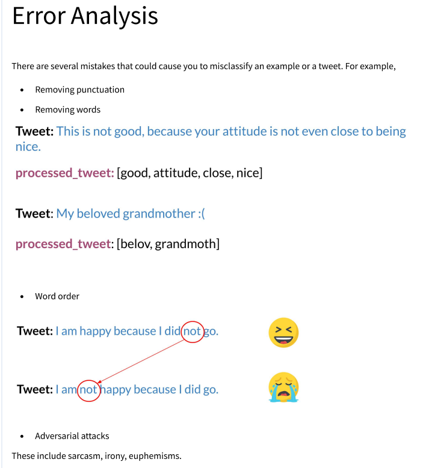