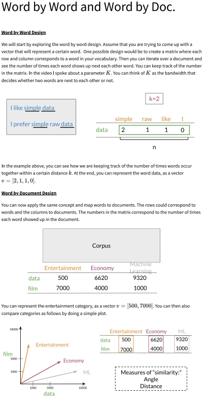
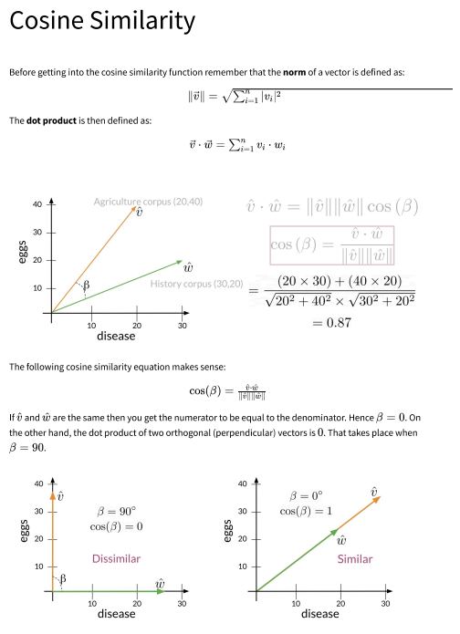

# WEEK 3

### 1. Vector Space Models

### 2. Word by Word and Word by Doc

### 3. Euclidiann Distance

### 4. Consine Similariry: Intuition

### 5. Cosine Similarity:

### 6. Mnipulating word in vector space
