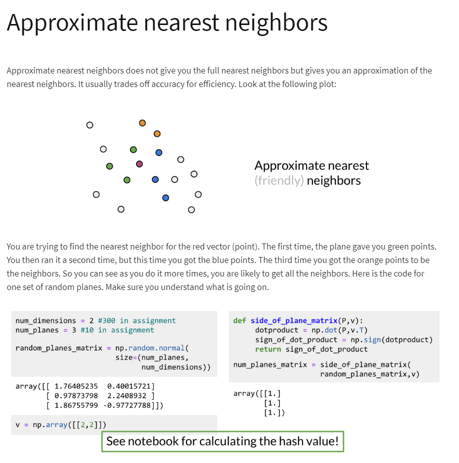

# WEEK 4

### 1. Transforming Word Vectors

### 2. K-nearest Neighbor

### 3. Hash Table and Hash Function

### 4. Locality Sensitive Hashing

### 5. Multiple Planes

### 6. Approximate Nearest Neighbors

### 7. Searching Documents
