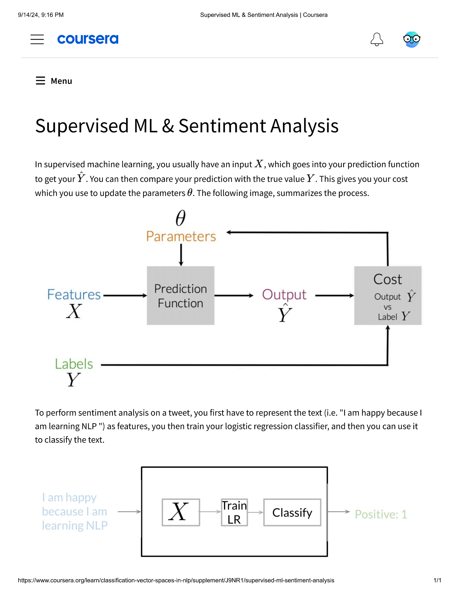
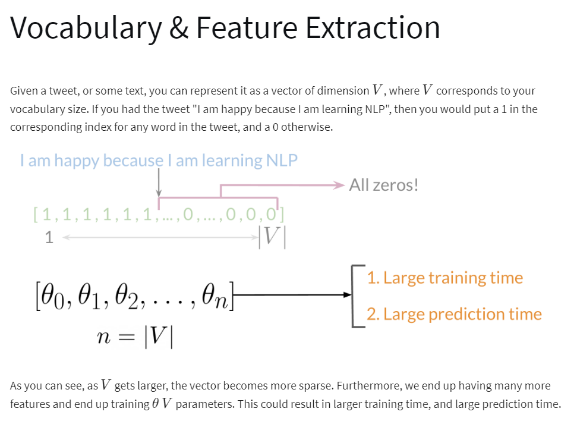
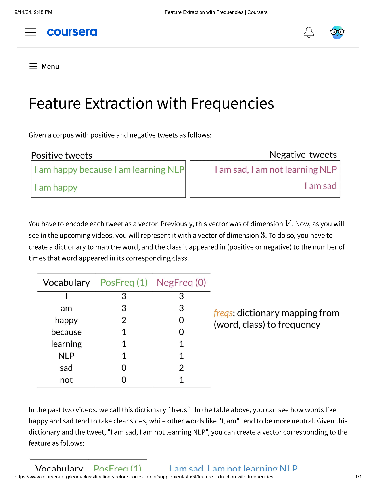
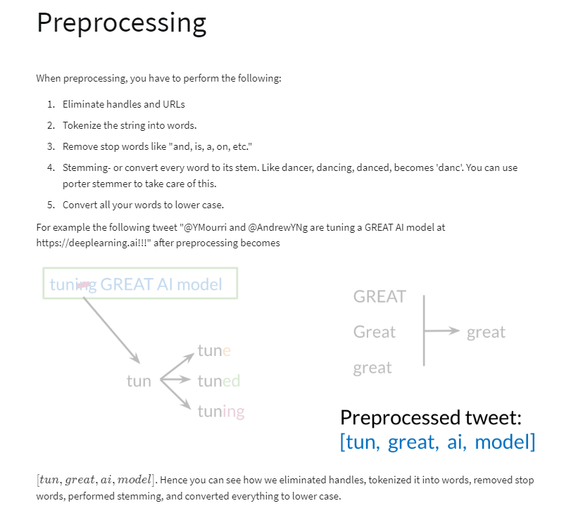
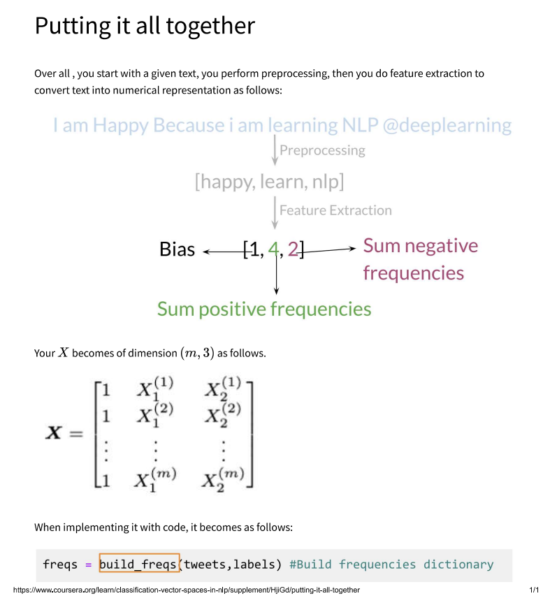

# SPEC: Natural Language Processing Specialization

## MOOC 1: Natural Language Processing with Classification and Vector Spaces

### 1. Supervised ML Training

### 2. Vocabulary and Feature Extraction

### 3. Feature Extraction with Frequencies

### 4. Preprocssing Text

### 5. Putting it all together
